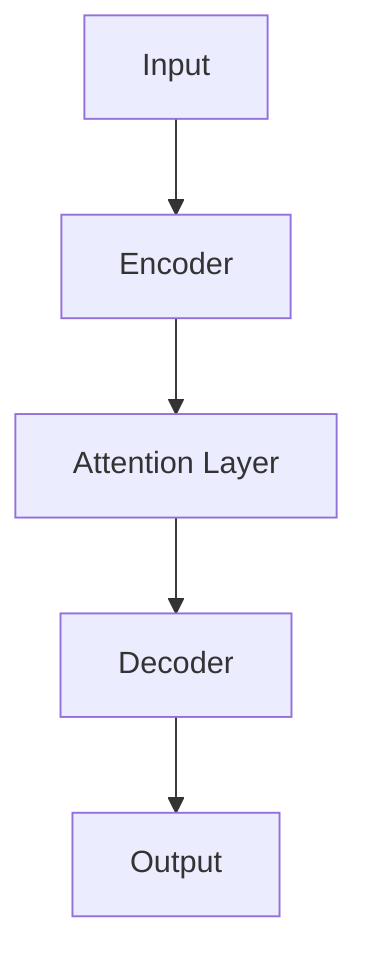
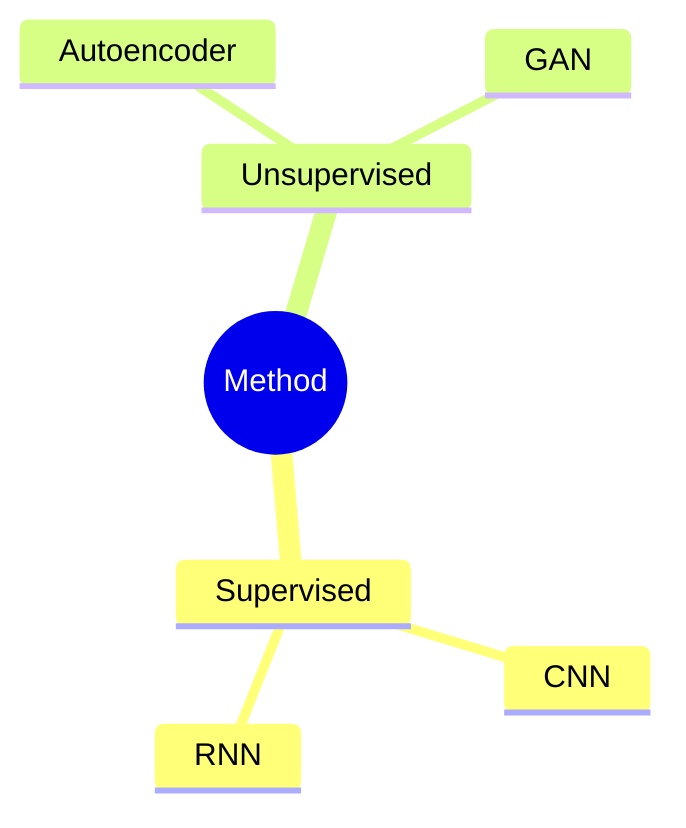

# Paper Title: [Full Title]

## Summary
[One-paragraph summary of the entire paper — problem, approach, key result]

## 1. [Section Name]

### Summary
[2-3 sentence summary of this section]

**Bold heading for a group of related points:**
- Point one
- Point two
- Point three


## 2. [Next Section]

### Summary
[Summary]

| Column A | Column B | Column C |
|----------|----------|----------|
| Value    | Value    | Value    |

### Key Parameters
| Parameter | Value | Description |
|-----------|-------|-------------|
| param1    | val1  | desc1       |

**Architecture overview (complex image → simplified diagram):**


**Mathematical formulation:**
$$ E = mc^2 $$

**Pseudocode:**
```python
def example():
    pass
```

**Classification (table → mindmap):**

