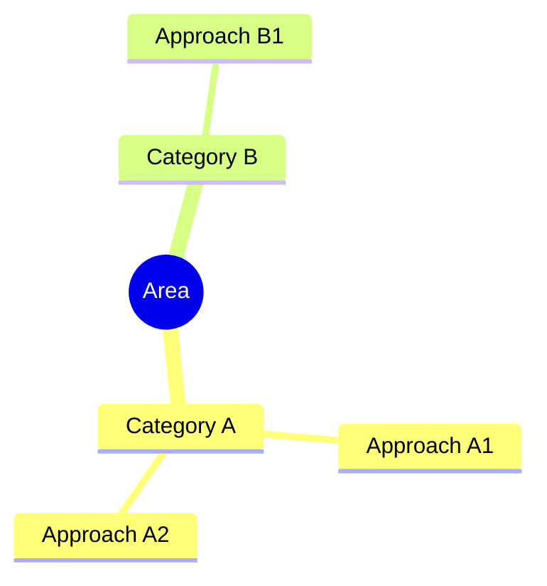
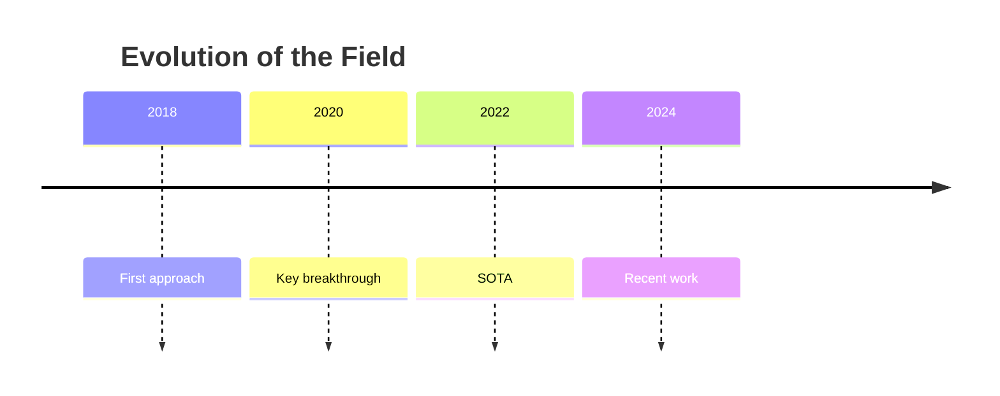

# [Full Title]

## 1. Introduction
[Scope of the survey, number of papers reviewed, methodology, and key contributions]

**Contributions of this survey:**
- Unified taxonomy / categorization
- Comprehensive comparison of approaches
- Identified open challenges and future directions

## 2. Taxonomy / Categorization
[Explain the classification framework]

**Taxonomy overview:**

**Chronological evolution (if applicable):**

## 3. Key Approaches

### 3.1 [Category A]
[Core idea of this category]

- **Method A1:** insight / advantage / limitation
- **Method A2:** insight / advantage / limitation

### 3.2 [Category B]

| Method | Key Idea | Strength | Weakness |
|--------|----------|----------|----------|
| B1     | ...      | ...      | ...      |
| B2     | ...      | ...      | ...      |

## 4. Comparison & Benchmark

### 4.1 Evaluation Protocol
[Common datasets, metrics, experimental setup]

### 4.2 Quantitative Comparison

| Method | Dataset A | Dataset B | Year |
|--------|-----------|-----------|------|
| M1     | 85.2      | 72.1      | 2020 |
| M2     | 90.1      | 76.3      | 2023 |
| **M3** | **91.3**  | **78.5**  | 2024 |

### 4.3 Qualitative Trade-offs

| Aspect | Method A | Method B | Method C |
|--------|----------|----------|----------|
| Accuracy | High | Medium | Low |
| Speed | Slow | Fast | Fast |

## 5. Open Challenges & Future Directions
[Overview of current gaps]

**Challenge 1 — [Title]:** description, why it is hard

**Challenge 2 — [Title]:** description, why it is hard

**Future directions:**
1. Direction 1
2. Direction 2
3. Direction 3

## 6. Conclusion
[Recap of taxonomy, key findings, landscape summary]
